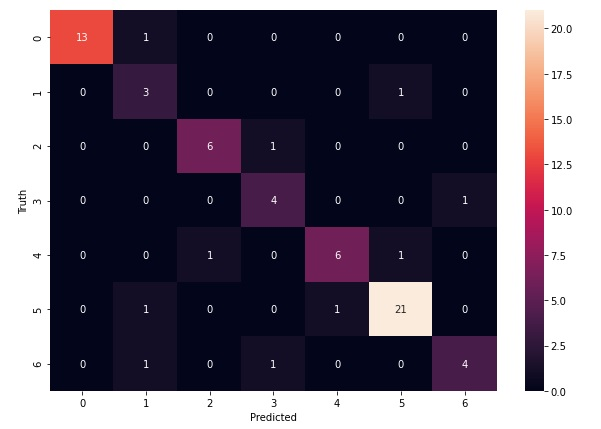
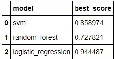

# Politician-Face-Classifier

# Web Scraping
* Collected images from google through web-scraping using Selenium with ChromeDriver 

# Data Cleaning
*  Performed data cleaning through face detection using OpenCV pre-trained feature-based  Haar cascade classifiers to discard images from the dataset without face and two eyes visible  

# Feature engineering
* Performed feature engineering through extraction by wavelet transformation of images using PyWavelets and then vertically stacking raw and wavelet transformed images 

# Model Building
 trained machine learning models such as Logistic Regression, SVM(Support vector machine), and Ensembling bagging Random Forest
 
# Model performance

Achieved 85% test accuracy after hyper tuning the model With Logisic regression
 
 
# User interface
*  Used HTML,CSS and JavaScript,

# Productionization
* Deployed model to production using Flask

# Technologies 
* Python
* Numpy and OpenCV for data cleaning
* Matplotlib & Seaborn for data visualization
* Sklearn for model building
* Python flask for HTTP server
* HTML/CSS/Javascript for  UI

©SyedMuhammadHamza Licensed under [MIT License](https://github.com/SyedMuhammadHamza/Politician-Face-Classifier/blob/main/LICENSE)
